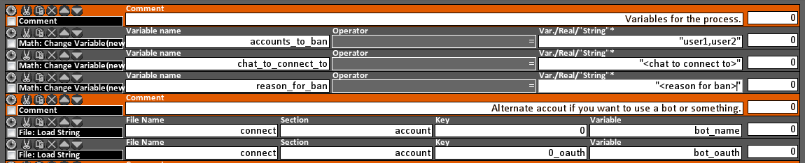

# PLEASE READ BEFORE USING
This extension can be used with LioranBoard to ban a large number of users at a time. The only catch is that you have to use LioranBoard for it. 

A few MAJOR things to note.
1. This is not by any means a FAST process. It's faster than a human but that's about it. 
2. Due to Twitch Limitations you will only be able to ban around 190 users a minute. 
3. The above basically means if you want to ban around 10,000 users you are looking at roughly 53 minutes of processing time. This will need time to run.
4. Due to some limitations in LioranBoard with how long variables can be DO NOT try to ban more than 2,000 users at a time. If you want to do more at least make sure the variable ends at the correct spot.

## Requirements
1. [LioranBoard](https://obsproject.com/forum/resources/lioranboard-stream-deck-animator.862/) is required to do this. It must be at least version 1.44a.
2. This extension.

## How to install
1. Download LioranBoard and unzip the folder. The contents of that zip folder contains the reciever (where the button is created) and a stream deck for both PC and android. If you don't want to create a twitch trigger than you will need to open the PC stream deck.
2. Download this extension. At the top of this page click on "Code" then click on "Download ZIP". That will download a zip folder of this entire repository. Unzip this folder. 
3. Open LioranBoard (minimum v1.44a) and at the bottom left click on "Install Extension" and find the location that you put the BanList.lbe file. Then find the "tsl_transmitter.html" file that lives in the LioranBoard folder.

That's it! You've installed the extension. Next we will create a button that takes a list and sends it to the extension to ban.

## How to use
1. You will need a deck with space to create a button. I won't work that out here as there is far better documentation for working with LioranBoard [here](https://christinna9031.github.io/LBDocumentation/index.html).
2. When you create the button you will have 2 commands in it. 
    1. Math: Change Variable - Sets a vairable with all the users to ban.
        - The variable here holds a list of COMMA (,) delimited values. You have to put them in this format before processing and wrap the list in " ". They cannot be on new lines. Notepad or some other application is advised to set this up. The process will trim off empty space on each username so you don't need to worry about that part.
    2. Send to Extension - Sends a command to run the extension.
    3. Should look something like this.   
    4. NOTE!!! The variable has " " around it. This is very important.
3. Trigger the button. You can either add a twitch trigger or just open the PC stream deck and click the button. 
4. LET THE PROCESS RUN. 

And that's it. Once the process is finished the users will be banned. If you want to keep track of how it's going either open your twitch chat and watch the bans fly or keep an eye on the application. A notification will pop every 30 seconds with how much is left.

    